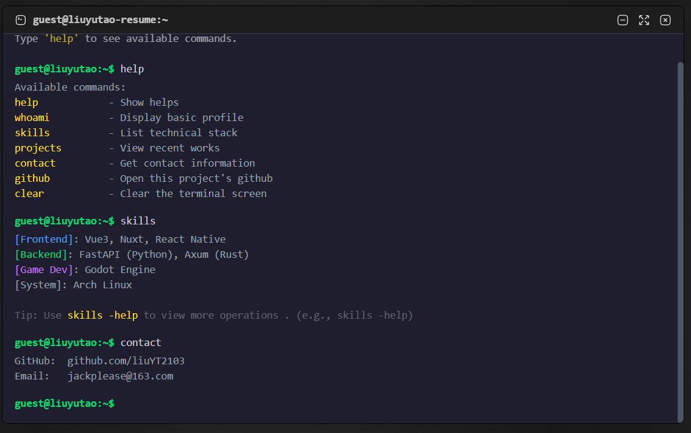

# Interactive Terminal Resume

基于 Vue 3 和 TypeScript 开发的网页端交互式简历，模拟命令行界面。访问者可通过输入终端命令查看个人信息、技能栈和项目经验。

## 预览
[查看简历](https://resume.atnn.top/)



## 功能特性

* **命令解析**：支持基础命令及参数解析（例如 `skills -d <name>`）。
* **历史记录**：记录并渲染命令执行历史，输出更新后自动滚动至底部。
* **状态管理**：实现终端窗口的最大化、最小化状态切换及对应的 CSS 过渡动画。
* **数据解耦**：简历数据（技能、项目等）与核心视图组件解耦，统一由 TypeScript 字典维护。
* **焦点接管**：点击终端主体任意区域自动聚焦至底层输入框。

## 快速开始

### 环境要求

* Node.js

### 安装与运行

1. 克隆项目到本地：

```bash
git clone https://github.com/liuYT2103/ttresume.git

```

2. 进入项目目录：

```bash
cd your-repo-name

```

3. 安装依赖：

```bash
npm install

```

4. 启动本地开发服务器：

```bash
npm run dev

```

## 可用命令

| 命令 | 参数 | 描述 |
| --- | --- | --- |
| `help` | 无 | 显示所有可用命令的列表。 |
| `whoami` | 无 | 显示基本个人简介与职位信息。 |
| `skills` | `-d <name>` | 列出技术栈概览。使用 `-d` 参数及技能名称可查看掌握详情（例如 `skills -d vue3`）。 |
| `projects` | 无 | 列出近期参与和开发的重点项目。 |
| `contact` | 无 | 显示 GitHub 主页及联系邮箱。 |
| `clear` | 无 | 清空当前的终端输出历史。 |

## 配置与自定义

简历内容和命令逻辑独立于 UI 组件。如需更新内容，请修改对应的 TypeScript 数据文件：

* **修改技能数据**：在 `skillsData` 字典中按定义的接口格式增加或修改条目，系统会自动按 `type` 字段分类渲染。
* **新增命令**：在 `cmdLib` 中注册新的命令对象，并实现对应的 `output` 解析函数。

## 技术栈

* **核心框架**: Vue 3 (Composition API)
* **开发语言**: TypeScript
* **样式处理**: Tailwind CSS (v4)
* **图标组件**: Hugeicons
